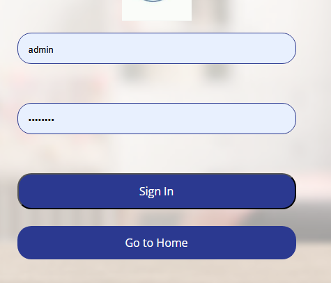
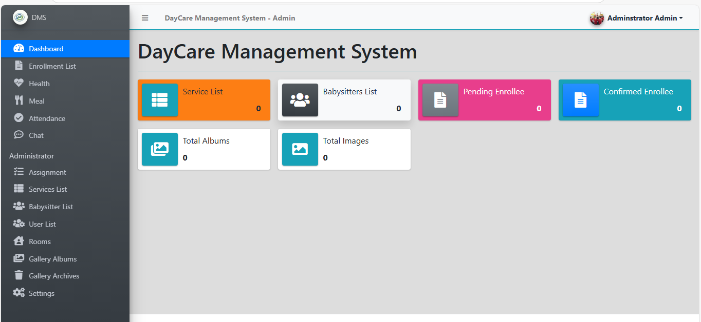

🧸 Daycare Management System
This Daycare Management System is designed to streamline and simplify the daily operations of a daycare center. It provides an efficient platform for managing children’s data, assigning babysitters, recording daily health and meal logs, attendance, and facilitating communication among users.

🚀 Features
Admin Panel:

Create and manage parent and babysitter accounts.

Assign babysitters to children.

Parent Dashboard:

Enroll child information.

Record daily meal details for each child.

Babysitter Dashboard:

View assigned children and their meal information.

Record daily health status for each child.

Mark child attendance daily.

Generate reports related to:

Health status

Meal details

Attendance

Chat System:

All users can communicate with each other through an internal chat feature.

🛠️ Tech Stack
PHP

JavaScript

Bootstrap

phpMyAdmin (for MySQL database management)

📂 Database
The database file is included in the /database folder. Import it using phpMyAdmin to get started.

🔐 Credentials
Admin Login:

Username: admin

Password: admin123

Super Admin Login:

Username: super admin

Password: super admin

